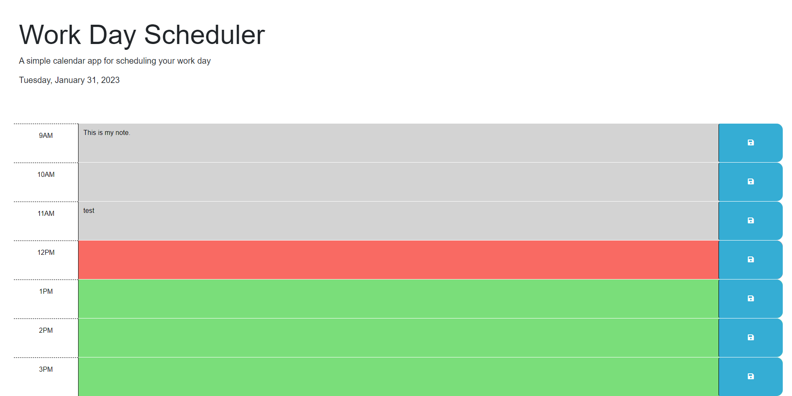
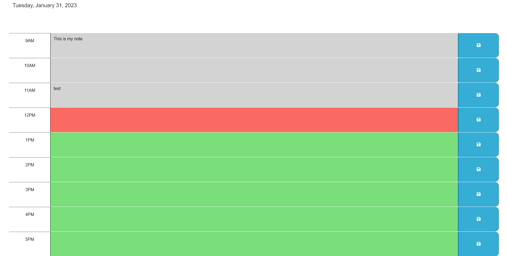

# Module 5 Challenge
Workday SCheduler

## Description

This application is a workday scheduler. It shows the current date at the top of the page, and shows hours 9-5 and knows the current hour of the day. The hours will change color depending on the time; gray for past, red for present and green for future. There is also a text box in each time slot which allows for entering notes, and the save button will save those notes. Whatever notes were saved will be stored into local storage and be available when refreshing the page.

## Screenshots

## Link
